<!-- Cards in assets/svg are generated by scripts/render_svgs.py. Edit the data there and re-run it. -->


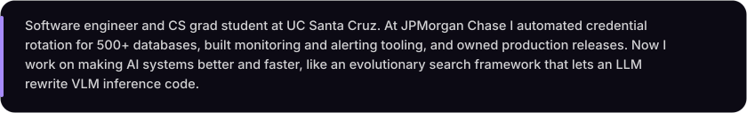

<picture>
  <source media="(prefers-color-scheme: dark)" srcset="assets/svg/header-experience-dark.svg">
  <source media="(prefers-color-scheme: light)" srcset="assets/svg/header-experience-light.svg">
  
</picture>




<picture>
  <source media="(prefers-color-scheme: dark)" srcset="assets/svg/header-projects-dark.svg">
  <source media="(prefers-color-scheme: light)" srcset="assets/svg/header-projects-light.svg">
  
</picture>

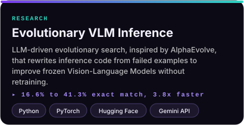
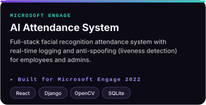
<a href="https://github.com/KiranRana123/AI_Interviewer">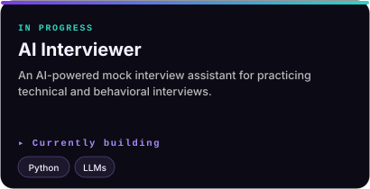</a>
<a href="https://github.com/KiranRana123/recipe-app-api">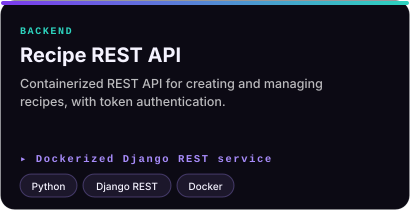</a>
<a href="https://kiranrana123.github.io/FileShare/">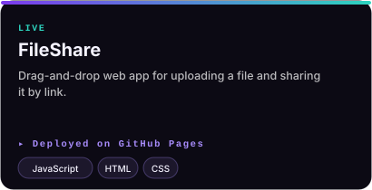</a>
<a href="https://github.com/KiranRana123/dsa-prep-cpp">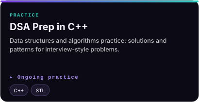</a>

<picture>
  <source media="(prefers-color-scheme: dark)" srcset="assets/svg/header-stack-dark.svg">
  <source media="(prefers-color-scheme: light)" srcset="assets/svg/header-stack-light.svg">
  
</picture>


<picture>
  <source media="(prefers-color-scheme: dark)" srcset="assets/svg/header-stats-dark.svg">
  <source media="(prefers-color-scheme: light)" srcset="assets/svg/header-stats-light.svg">
  
</picture>

  
  

<picture>
  <source media="(prefers-color-scheme: dark)" srcset="https://raw.githubusercontent.com/KiranRana123/KiranRana123/output/github-snake-dark.svg" />
  <source media="(prefers-color-scheme: light)" srcset="https://raw.githubusercontent.com/KiranRana123/KiranRana123/output/github-snake.svg" />
  
</picture>

<picture>
  <source media="(prefers-color-scheme: dark)" srcset="assets/svg/header-education-dark.svg">
  <source media="(prefers-color-scheme: light)" srcset="assets/svg/header-education-light.svg">
  
</picture>


<picture>
  <source media="(prefers-color-scheme: dark)" srcset="assets/svg/header-leadership-dark.svg">
  <source media="(prefers-color-scheme: light)" srcset="assets/svg/header-leadership-light.svg">
  
</picture>


